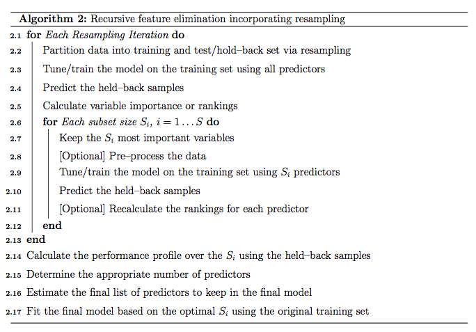

```{r, include=FALSE}
knitr::opts_chunk$set(echo = FALSE, warning = FALSE, message = FALSE, fig.pos="H", out.extra="")
library(tidyverse)
library(knitr)
library(car)
library(knitr)
library(purrr)
```

# Introduction

The Canadian Constitution requires federal elections to be held at least every five years. By convention, Canada has been holding federal elections every four years, although in some cases they may break this pattern as the governor general can dissolve parliament and call an election [@thecanadianencyclopedia]. 

Canada is divided into 338 constituencies, also known as ridings. Canada runs on a political party system where each party has one leader, the candidate running for Prime Minister, and representatives of that party attempting to win over a riding. On election day, registered voters will vote in the polling divisions within their riding, and select one member of parliament representing the party of their choice. The leader of the Canadian party that wins over the majority of ridings (170 of the 338) will become the Prime Minister. 

With the next Canadian federal election taking place in 2025, the goal of our report is to predict the overall popular vote using a regression model with post-stratification. Post-stratification is a way to adjust the weighted totals within mutually exclusive cells so that they equal the known population totals [@kolenikov_2016].  This helps account for differences between two populations, for example, some surveyed groups of people, and the true census population. By post-stratifying, we will obtain better results and make better inferences about the true population. 

The most popular vote is determined by the political party that has the highest number of votes, and this outcome will be the party that is most likely to win the election. This might not always be the case, however, because ridings vary in population. The party with the highest number of votes may not always win because another party might have won more ridings with narrow margins [@cicnews]. As the ridings are being redrawn for the 2025 election cycle, our predictions will be based on the party with the highest proportion of predicted votes both at the national and provincial levels. 

We explore three main models across two different sets of predictors (a full set and a reduced subset), where all of the models are either Generalized Additive Models (GAMs) or Generalized Additive Mixed Effects Models (GAMMs). We explore these models primarily as a trade off being being able to capture non-linearities in the data in a non-parameteric way (we do not assume the data take on some functional form, e.g., a line) through the nature of regression splines and interpretability of our model (e.g., being able to add in categorical predictors meaningfully). As a result, we find extremely promising predictive performance. We also approach this task from a prediction point of view, where we evaluate our models on a 20% test set. Overall, we find some exciting results using GAMs rather than the Bayesian linear mixed effects models often seen in literature, especially with our models predicting provincial party winners with 100% accuracy.


# Data

The Canadian Election Study is an annual study of voting trends, demographics, and other preferences that are assumed to be related to Canadian voters' political behavior. The major goals of CES are to give a comprehensive account of the election, to emphasize the key factors that influence people's voting decisions, to show what changes and remains constant throughout the campaign and from election to election, and to draw attention to the similarities and differences between voting and elections in Canada and other countries. According to the dataset, 37822 people were surveyed and 620 variables were measured. The campaign survey began on September 13, 2019, and finished on October 21, 2019, while the post-election survey started on October 24, 2019, and ended on November 11, 2019. 

The population is all Canadian citizens and permanent residents aged 18 or older. The sampling frame is the list of all Canadians and permanent residents older than 18, the framed population is the eligible residents who could access the survey, and the sampled population is the Canadians who saw the survey and completed it. The campaign survey and post-election survey are delivered online and collected by Advanis.Inc and presented on Qualtrics online platform.

Qualtrics gathered a sample from various panels for CES. They use stratified sampling, which divides people into groups according to province/territory and ensures that each region is balanced regarding gender and age.

The General Social Survey (GSS) gathers comprehensive socio-demographic data, including information on age, sex, education, religion, ethnicity, income, etc. The General Social Survey's two main goals are to give information on specific social policy concerns and to collect data on social trends in order to identify changes in Canadians' living conditions and well-being across time. All non-institutionalized individuals and non-residents of First Nation communities who are 15 years of age or older and reside in one of Canada's ten provinces make up the target population for GSS.

Questionnaires are distributed in order to gather data for the census. Similar to CES, a probability sampling-based stratified design provides a framework for the regular sample. At the provincial level, the stratification is conducted out. One household member at least 15 years old is chosen randomly to provide the information.

## Data Cleaning Process
During the cleaning process, our goal was to clean any irrelevant values and extract variables that were in both datasets for our post-stratification analysis. We began with cleaning the CES 2019 Online Survey dataset. We used the documentation ([\underline{CES Documentation}](https://github.com/hodgettsp/ces_data/blob/master/documentation/ces2019/Canadian%20Election%20Study%2C%202019%2C%20Online%20Survey.pdf)) to figure out what the original variables represented and what the factors for the responses meant. After this process, we had to change variables in the GSS census data as well to ensure that the common variables had the same factors.  

After identifying common variables that matched the GSS Census data, we used R functions to mutate the data into categories. One example was changing the original cps19 education data. For education, the values 1 to 11 originally represented different education levels. We used the `mutate()` function to change these numbers into categories. We changed the numbers 1 to 4 to "No degree/diploma", 5 to "High School", 6 and 7 to "College/Trade", 8 and 9 to "Bachelor", and 10 to 11 to "Postgrad". This process was done for other variables as well, such as provinces, incomes, health, and age. We also did this same process in the GSS data, to ensure that the categories within the common variables of the census were the same. For example, the original GSS data had the following categories: "Less than", "High school", "College", "Bachelor's degree (e.g. B.A., B.Sc., LL.B.)", and "University certificate, diploma or degree above the bach". We changed these factors to match what we had in the cps19 data by mutating these categories respectively to "No degree/diploma", "High school", "College/Trade", "Bachelor", and "Postgrad". These categorical variables could then be used as random effects to determine who the respondent would vote for, and would also help when creating the post-stratified results.

We also changed these categories into factors by using the following line, `mutate_if(is.character, as.factor)`. This automated the process of turning the variable options into factors in order to do computations. Additionally, many cells within variables originally had NA values. After we selected our variables of interest and mutated the factors respectively, we made sure do use the `drop_na()` to remove NA rows within the data frame. 

## Summary of Data and Variables

For our model, we initially started looking for predictor variables by seeing which ones were common between the CES dataset and the GSS dataset. Doing so would allow for the post-stratification of these variables. We found that there were several variables in common between the datasets, which included age, language, birthplace, citizenship status, province, the ownership of a home, income, education, voting choice, marital status, health, and sex. The table below shows all the variables of the CES and GSS data, along with the number of observations for each response option.
  
```{r, include=TRUE, echo=FALSE}
opts <- options(knitr.kable.NA = "")
clean_colon <- function(x) {
  x <- gsub("\\s+", " ", x)
  x <- sub(":", ", n=", x)
  return(x)
}


survey_table <- read_csv("ces2019_web_all_predictors.csv") %>% 
  mutate_if(is.character, as.factor) %>%
  select(-income_number, -cps19_ResponseId)

survey_sum_1 <- summary(survey_table[1:6])
survey_sum_2 <- summary(survey_table[7:12])
survey_sum_3 <- summary(survey_table[13:18])

survey_clean_1 <- as.data.frame(apply(survey_sum_1, 2, function(x) clean_colon(x)))

survey_clean_2 <- as.data.frame(apply(survey_sum_2, 2, function(x) clean_colon(x)))

survey_clean_3 <- as.data.frame(apply(survey_sum_3, 2, function(x) x))

knitr::kable(tibble(survey_clean_1), align = "cccccccccccccccccc", caption = "CES 2019 Summary Statistics")
knitr::kable(tibble(survey_clean_2), align = "cccccccccccccccccc", caption = "CES 2019 Summary Statistics")
knitr::kable(tibble(survey_clean_3), align = "cccccccccccccccccc", caption = "CES 2019 Summary Statistics")
```

There are 5312 observations overall after missing data removal, most of the samples are Canadian citizens. The survey received replies from 50 percent males and 50 percent women, as they would have expected. The poll includes 2785 males and 2527 females, with the age groups of 55 to 64 (1286) and 65 to 74 (1222) having the highest proportions, which is 47.21% of the overall sample population, followed by middle-aged people. 1981 individuals—or 37.3% of the total—have bachelor's degrees, followed by 1647 individuals who attended colleges. People who speak English as their first language account for 70% of the sample (3725), while native French speakers account for 644. There are also persons who can speak both English and French (653), as well as a small number of people who speak neither English nor French as their first language. The largest number of participants in the survey was in Ontario, with 2171 people, accounting for 40.9% of the total. Although the income distribution is fairly equal, we still recognize that 10% of the population earns less than \$25,000 a year. The samples are primarily older adults and middle-aged adults, therefore their annual income of \$25,000 does indicate that they are impoverished. The majority of people (2592) believe they are in very good health, yet 1517 still believe they are in bad health. The limitation would be that people might exaggerate to obtain more compensation or to persuade the government to treat the issue more seriously, which could lead to the health statistics not being accurate. More information about the relationship between these predictors and voting preferences is provided in the following section.

  
```{r, include=TRUE, echo=FALSE}
opts <- options(knitr.kable.NA = "")

census_table <- read_csv("gss_clean_poststrat.csv") %>% 
  mutate_if(is.character, as.factor)
summarised_1 <- summary(census_table[1:5])
summarised_clean_1 <- as.data.frame(
  apply(summarised_1, 2, function(x) clean_colon(x)))

knitr::kable(tibble(summarised_clean_1), align = "ccccccccccc",caption = "GSS Summary Statistics")

summarised_2 <- summary(census_table[6:11])
summarised_clean_2 <- as.data.frame(
  apply(summarised_2, 2, function(x) clean_colon(x)))

knitr::kable(tibble(summarised_clean_2), align = "ccccccccccc",caption = "GSS Summary Statistics")
```
The cleaned GSS has 10066 observations. The behavior of each predictor, such as gender, education, and wealth, is similar to the General Election Study. It is important to point out that while 4642 people believe they have good health, 3030 believe they have exceptional health, and 2351 believe they have poor health, accounting for 23% of the overall population as contrasted to 30% from the GES, respectively. The General Social Study is less biased than the General Election Study because people are unaware of its objective.

```{r, include=FALSE}
census_data <- read_csv("gss_clean_poststrat.csv")
survey_data <- read_csv("ces2019_web_all_predictors.csv")
```


```{r, include=TRUE, echo=FALSE, fig.width=8, fig.height=5}

a <- census_data %>% group_by(income_category) %>% 
  summarise(census = n())

b <- survey_data %>% group_by(income_category) %>% 
  summarise(survey = n())

income_data = tibble(merge(a, b, by="income_category"))

income_data %>% 
  pivot_longer(col=-income_category)  %>%
  ggplot(aes(x = factor(income_category), y = value, fill = name)) +
  geom_bar(stat = "identity", position = "dodge") +
  labs(title="Figure 1: Income frequencies among participants in both the census and survey data.", 
       x="Income levels", 
       y="Number of people",
       fill="Data source") +
  theme(axis.text.x = element_text(angle = 45, hjust = 1))
```

Figure 1 tells us some information about our survey data. We can see that there were more participants in census data with income levels of "25,000 to 74,999 and "Less than 25,000" than the rest of the categories. In contrast, within the survey data, the frequency of the income level "Less than 25,000" is the lowest. We can see that using income as a random effect will more accurately represent the population once it is post-stratified.


```{r, include=TRUE, echo=FALSE, fig.width=8, fig.height=4}
c <- census_data %>% group_by(health) %>% 
  summarise(census = n())
d <- survey_data %>% group_by(health) %>% 
  summarise(survey = n())
health_data = tibble(merge(c, d, by="health"))
health_data %>% 
  pivot_longer(col=-health)  %>%
  ggplot(aes(x = factor(health), y = value, fill = name)) +
  geom_bar(stat = "identity", position = "dodge") +
  labs(title="Figure 2: Health conditions among participants in both the census and survey data.", 
       x="Health conditions", 
       y="Number of people",
       fill="Data source") +
  theme(axis.text.x = element_text(angle = 0, hjust = 1))
```

Figure 2 indicates the health conditions of the census and survey participants. It can be seen that in the census data, the highest reported health condition was Good/Very Good. This was also true in the survey data. One difference however is the census data having more reported conditions as Excellent than Poor/Fair conditions, while the survey data has the opposite. Similar to what we previously stated, people may exaggerate in order to get more money, convince the government to take the problem more seriously, or because they are dissatisfied with the current government, which could cause the health statistics to be inaccurate. This information tells us more about the sample population, and it will be interest to post-stratify to match the census population weights.

## Justifying predictor variables
As the purpose of our paper is to determine the most popular vote, we wanted to choose variables we thought would have some effect on the voting outcome. To justify which predictor variables would be the best choices, we will explore some of them in more detail.

A survey done prior to the 2020 Federal Election by EKOS Research Associates surveyed people in different groups ($n$=3006) to measure vote intention by demographics. One of the questions asked was “If a federal election was held tomorrow, which party would you vote for?”. The answers to this question were then analyzed based on several demographics [@ekos_politics_2020]. We will prefer the demographics that provided the highest variation in voting intention, as these would likely have a strong effect as a predictor for who someone might vote for.

### Age
In the study, the liberal party had the highest percentage of people who intended to vote for them. In the age group 35-49, the percentages were 39% for liberals and 34% [@ekos_politics_2020] for conservatives. This was a smaller difference than the other groups, as the percentage of people intending to vote liberal was much higher than people who voted intended to vote conservative for people aged 50 and over. In addition, a second study that mentioned that voter turnout rates were much higher for people over 50 [@uppal_larochelle-côté_2012]. This could indicate that age does have some influence on peoples voting choices. There are also many societal factors that may push a certain age group to vote for a specific party, such as students voting for a party that would fund their studies. 

Additionally, we will do a two group hypothesis test to answer the following question: Does the proportion of people aged 15-24 who intend to vote for the liberal party differ between the people aged 65-74 who intend to vote for the liberal party? We will use the CES 2019 data to do this.

Null hypothesis: There is no difference between the proportion of liberal votes for people aged 15-24 and the proportion of liberal votes for people aged 65-74: $H_0: p_{young} - p_{old} = 0$

Alternative hypothesis: There is a difference between the proportion of liberal votes for people aged 15-24 and the proportion of liberal votes for people aged 65-74: $H_0: p_{young} - p_{old} \neq 0$ ($\alpha = 0.05$)

where, $p_{young}$ represents the proportion of liberal votes for people aged 15-24,and $p_{old}$ represents the proportion of liberal votes for people aged 65-74.

We conduct a $z$ test for the difference between the two proportions. This test assumes $z$ to be approximately normally distributed under the null hypothesis. The test statistic will determine the p-value which will tell us whether or not we should reject the null hypothesis. It follows, $$Z = \frac{\hat p_{old}- \hat p_{young}}{\hat p (1 - \hat p) (\frac{1}{n_{old}} + \frac{1}{n_{young}})}, \text{where} ~ \hat p = \frac{votes_{old} + votes_{young}}{n_{young} + n_{old}}$$ where $votes_{old}$ represents the total votes of people aged 65-74, and $votes_{young}$ represents the total votes of people aged 15-24. 

```{r, include = TRUE, echo = FALSE}
# Proportion of liberal votes by age group
proportions <- survey_data %>% 
  select(age_category, vote_choice) %>% 
  group_by(age_category) %>% 
  summarise(n=n(),
            liberal_votes = sum(vote_choice == 1),
            proportion = (liberal_votes / n) %>% round(digits=3))

votes_young<- as.numeric(proportions$liberal_votes[1]) # 15-24 proportion
n_young <- as.numeric(proportions$n[1])

votes_old <- as.numeric(proportions$liberal_votes[6]) # 65-74
n_old <- as.numeric(proportions$n[6])

test <- prop.test(x=c(votes_old, votes_young), n=c(n_old, n_young))

output_proportions <- proportions %>%
  rename(`Age range` = age_category, `Number of obersvations` = n, `Total who would vote liberal` = liberal_votes,
         `Proportion` = proportion) %>%
  kable(caption = "Proportion of intended liberal votes by age group from the CES 2019 data")

output_proportions
z <- sqrt(test$statistic) %>% round(digits=3)
p <- 2*pnorm(z, lower.tail=FALSE)

lower_b <- test$conf.int[1] %>% round(digits=3)
upper_b <- test$conf.int[2] %>% round(digits=3) 

```

From this data, we can see that $\hat p_{old}$ = `r (votes_old / n_old) %>% round(digits=3)`, $\hat p_{young}$ = `r (votes_young / n_young) %>% round(digits=3)`, $n_{young}$ = `r n_young` and $n_{old}$ = `r n_old` . A built in function called $prop.test()$ was used. This function takes in two vectors, where each vector contains the groups proportion and number of observations.

After conducting a two proportion Z test at a 95% confidence level, there was strong evidence against the null hypotheses ($z$ = `r z`, $p$ =`r as.numeric(test$p.value)`). We can interpret that there is a difference between the proportion of liberal votes for people aged 15-24 and the proportion of liberal votes for people aged 65-74. Similarly, using the formula below, the confidence interval was calculated. 

$$(\hat{p}_{\text{old}} - \hat{p}_{\text{young}}) \pm z_{\frac{\alpha}{2}}\sqrt{\frac{\hat p_{old}(1- \hat p_{old})}{n_{old}} + \frac{\hat p_{young}(1-\hat p_{young})}{n_{young}}}$$
The calculated interval was (`r lower_b`, `r upper_b`). We are 95% confident that the true difference of the proportion of liberal votes between the two groups lie in this range. As the interval does not contain 0, it is evident that some difference occurs, and this gives further evidence that age is a good predictor for voting outcomes.

### Sex
According to their analysis of voting intention by gender, the percentage of men who would vote liberal was 35%, and the percentage of men who would vote conservative was 37%.  However, the percentage of women who would vote liberal was 47%, and the percentage of women who would vote conservative was 23% [@ekos_politics_2020]. This data indicates some evidence for the gender divide within Canada, as there is only a 2% difference in male voting intentions as opposed to a 24% difference in female voting intentions for the two largest parties in Canada. Hence, we will use the ‘sex’ variable as one of our predictors as it could possibly have an impact on voting outcomes. 

### Province
The study also explored the voting intention by province. Although some provinces had similar voting intentions for the two major parties of Canada, conservative, and liberal, there were clear differences with other provinces. For example, in British Columbia, there was an equal percentage of people who had the intention of voting for the liberal and conservative parties. Precisely, 33% of British Colombians intended to vote for the liberal party, and 33% of British Colombians intended to vote for the conservative party. In contrast, Alberta has 55% of individuals intending to vote for the conservative party, and 22% intending to vote for the liberal party [@ekos_politics_2020]. We can see that there is a clear difference in the political landscape between these two provinces, as Alberta highly favors the Conservative party, while British Columbia has no favorite. Overall, every province besides Alberta and Saskatoon favored the liberals, but it was clear that conservatives were favored extremely in these two provinces. Through these results, it is evident that province would be a good variable to look at when it comes to predicting who someone would vote for.

### Education
In the study, the voting intentions of individuals were looked at between 3 education groups. These groups were “High school”, “College”, and “University”. The voting intention of high school and college students for the conservative and liberal parties was of similar proportions. However, for universities, there was a clear distinction, as 46% of people in this group said they would vote for the liberal party, while 26% said they would vote for the liberal party [@ekos_politics_2020] . This distinction indicates that education would be a good predictor for voter outcomes. 

### Income
The study also examines social class in four groups, “Poor”, “Working class”, “Middle class”, and “Upper class”. Each class favors the liberal party, however, the middle and upper classes favor the liberals more than the poor and working class. They also have a lower proportion of people who would vote conservative. In the upper class, 44% would vote liberal and 22% would vote conservative. In the working class, 36% would vote liberal and 32% would vote conservative [@ekos_politics_2020]. This distinction indicates that it could be a good predictor variable. 

### Language
Languages are said to have an influence on one's culture. People have argued that moral identity is a cultural construct [@10.3389/fpsyg.2017.00412] and that it is context-dependent which ties it to different social and cultural obligations. As Canada has two official languages, English and French, the moral identity between these groups of people could have an influence on their voting choice. For example, in Quebec, French is their first language and is used to communicate. In other provinces and regions, English is used. Due to the fact that language has a large influence on culture, there are evidently some cultural differences between French Canada and English Canada [@santa_fe_relocation_2019]. These differences may lead to individuals having different perspectives from a moral standpoint on issues within Canada, and thus could be a great predictor of voting outcomes.


$\\$
By examining a subset of the total variables we found in more detail, we have conclusively found sex, province, age, education, income, and language to be some of the better predictors to use as random effects in our final model.

# Methods

Primarily, we are looking to predict the results of the 2025 Canadian Election, i.e., which party (out of the 6 major parties) will win the election. But immediately, we are faced with a major challenge; namely, the Canadian electoral districts are getting redistributed as part of a 10 year cycle. As stated in the introduction, by Canada's parliamentary system, the party that wins the most seats by riding would win the federal elections [@electionscanada]. To work around that, we will instead look to both predict the share of votes at a national level and at the provincial level, the most geographically granular level our data sets allow (both the survey and census data we have).

Framing our goal as primarily a prediction problem opens us up to some interesting candidate models than if our goal were only interpretation or only prediction. One go-to model is the multilevel regression with post-stratification model, popularized in part from Andrew Gelman, who supervised the use of it for adjusting Xbox survey data to the 2012 American presidential election in @WANG2015980. We will largely follow this framework but explore extensions to this model by adding more group-level fixed effects and using regression splines through Generalized Additive Mixed Effects Models (GAMMs). We will also explore Generalized Additive Models without random effects (GAMs).

We choose these models over others since they provide the ability to faithfully model random effects (adjustments to the intercept or slopes by some group-level or categorical variable), some level of interpretability, along with a unified framework for regularizers (penalization likelihoods) and link functions that all work to create a model that allows for much greater non-linearity. In particular, we liked the "non-parametric" nature of GAMM model, i.e., we can let the data speak for itself in selecting the best functional form for each regression spline. Similarly, we can use restricted maximum likelihood (REML) to select $\lambda$ for the penalty term contribution.

The main benefit over more linear approaches (e.g., logistic or linear mixed effects models) is that GAMs allow us to capture non-linearities in the data. Additionally, computational support for penalized likelihood is more flexible with GAMMs (and GAMs more broadly) than packages that support generalized linear models (or generalized mixed effects models), and regression splines can be individually penalized. Such properties are especially appealing in our prediction task as penalization goes a long way to controlling model variance, i.e., reducing overfitting. Further, while multilevel regression provides some regularization, post-stratification cells counts can grow extremely quickly and end up being very sparse (very little observations in each cell) @WANG2015980, and so extra penalization from the splines could help our prediction accuracy.

One remedy to this would be to look towards Bayesian approaches for intepretable and flexible regularized models, but creating more informative priors that provide meaningful regularization are not sensible. COVID-19 has caused a rather large macro shifts in the Canadian economic and political landscapes, especially with respect to potential predictors, and Statistics Canada in 2021 has noted that the pandemic has impacted certain groups particularly hard and continues to do so [@arora_2021]. For example, visible minority groups have experienced, as a whole, high unemployment, and certain industries (like manufacturing) have been hit hard, meaning that workers in those industries would be impacted too. As a result of these changes, "standard" Bayesian techniques, such as those used in @WANG2015980 are not applicable as we cannot comfortably form reasonable and ethically informative beliefs on parameters for prior distributions, e.g., do we really know how a visible minority worker in manufacturing will value their money with respect to voting preferences today and how to encode that as a distributional parameter(s)?

On the other hand, we prefer GAMs and GAMMs over more "black box" techniques such as neural networks or tree-based models because such models are often more uninterpretable and less comparable to methods present in the literature. We do not consider neural networks here because there is not enough data to fit a likely overparameterized model. We also prefer GAM/GAMMs over tree-based models because while they are more interpretable, they do not allow for the careful addition of predictors into the model, e.g., they do not allow for the careful consideration of group-level effects, and they often do not generalize well to new combinations or levels of "factor" variables (cannot really extrapolate). So GAMMs are a good balance of a predictably capable model and an interpretable one.

However, for feature selection, we used a recursive feature elimination algorithm (RFE) that employs random forests. This is discussed more in detail under the model specifics, but we chose this to have a principled approach towards choosing a set of parameters useful for prediction (and another set of reduced parameters for a simpler model better for interpretation). We decided on random forests as the model for RFE because it is non-parametric (we did not want to assume a functional form of the data before choosing the predictors to explain the data) and allows for extraction of feature importance. Also for feature selection, we did not choose the features that would have the least multicollinearity because our goal ultimately is prediction accuracy and correlated features are still informative our voting choices, e.g., age and income.

## Model Specifics and Feature Selection

As mentioned above, we fit either GAMs or GAMMs, and we do so on a 80-20 train-test split. In other words, the models were fit on 80% of our available data with 20% of the remaining data only used for model evaluation. Both sets were chosen randomly.

Then, we first considered closely the predictors we investigated on sociological lines (sex, province, education, and income). And then decided to expand our set of potential predictors to the entire intersection of variables between the census data and survey data. As the full set of predictors has 17 elements, we felt the need to explore dimensionality reduction methods both to potentially reduce model variance and improve interpretation. This could have been done through shrinkage methods like L1 (lasso) penalties, but we wanted to see it more explicit, and as we computed average favour points based on the categorical predictor groupings (later used for post-stratification), such methods would lead to potentially inappropriate average favour scores should an L1 penalty, for example, shrink a predictor to have no effect. We decided on RFE because through cross-validation and resampling, we can pretty exhaustively consider permutations of the full predictor set for all possible sizes of predictor sets (1 to 17) to evaluate which predictors may be useful in prediction. In our experiments, we ran the RFE algorithm with random forest for reasons mentioned above (non-parametric and feature importance calculations). We ran this algorithm using the R `caret` package with 5-fold cross-validation five times.

{width="342"}

The RFE algorithm using random forest classifiers found that a reduced complexity model had the best accuracy in predicting the individual vote choices at $\approx$ 79.67% accuracy and a $\approx$ 0.71 Kappa, compared to $\approx$ 79.54% accuracy and a $\approx$ 0.7078 Kappa. As these metrics were all really close and are model-based (and could change somewhat by choosing a different model), we decided to try both sets of predictors. In fact, accuracy and Kappa values were all very similar when considering models with more than 8 predictors. We considered Kappa too since it accounts for class imbalance (which election vote choices certain do have) by computing:

$$
\kappa = \frac{p_0-p_e}{1-p_e}
$$

Where $p_0$ are the correctly classified observations and $p_e$ is the random change probability [@mchugh_2012].

So, we decided to use the following predictors for the reduced complexity model: `liberal_favour`, `conservative_favour`, `ndp_favour`, `bloc_favour`, `green_favour`, `people_favour`, `province`, and `language`, allowing us to create a new data set that contained only these variables by subsetting the full data set. Note that models fit with the full 17 predictors will be referred to as the full models or full complexity models, while models fit with the reduced 8 predictor data set will be referred to as the reduced models or reduced complexity models.

We then created three models per data set (full and reduced), one that was just random intercepts (incorporating all categorical variables available to us in either the reduced complexity data set or the full data set), one that was a mixed effects model, and one that was a fixed effects model (only the favour predictors). Additionally, we used a multinomial logit link as we have that the data (party predictions) are multinomially distributed since they are 6 parties with some probability of being vote for by some voter. Further, the only random effect we use is the so-called random intercept, following @WANG2015980, which allows us to adjust the intercept of the model for some combination group-level predictors, e.g., `province` and `language` combinations. We did not add random slope effects as we have no information on meaningful ways they would enter our model as they usually are based on some sociological investigation on how predictor effects are weighted (and thus require different slopes) by some group-level predictor as done in @ghitza2013.

In general, all of our GAMs and GAMMs take a form similar to a GLM. We have here that $\text{NumSplines}$ is the number of splines we use (equal to the number of favour predictors), $k=6$ as we have 6 parties, and $Z_i$ is the matrix of the categorical variables for observation $i$ and $U$ is the matrix of corresponding random effects. Putting it together we have:

$$
\begin{aligned}
y_i &\sim \text{Multinomial}(1, \mathbf{p}),~ \mathbf{p}~ = ~\{p_1, p_2, ..., p_k\} \\
\ln(\frac{\text{Pr}(y_i = 1)}{\text{Pr}(y_i=k)}) &= \sum_{i=1}^{\text{NumSplines}}f(x_i) + Z_iU + \beta_0 \\
\ln(\frac{\text{Pr}(y_i = 2)}{\text{Pr}(y_i=k)}) &= \sum_{i=1}^{\text{NumSplines}}f(x_i) + Z_iU + \beta_0 \\
&...\\
\ln(\frac{\text{Pr}(y_i = k-1)}{\text{Pr}(y_i=k)}) &= \sum_{i=1}^{\text{NumSplines}}f(x_i) + Z_iU + \beta_0 \\
\end{aligned}
$$

We can use the softmax function to compute the predicted probabilities instead of log-odds for party $p$ and the corresponding linear combination for class (party) $p$ from above:

$$
\text{Pr}(y_i = p) = \text{softmax} ( \sum_{i=1}^{\text{NumSplines}}f(x_i) + Z_iU + \beta_0 )
$$

Finally, note that as we are using p-splines, our splines take the following form for some number of basis functions $K$, where basis function $k, ~ 1 \leq k \leq K$ is denoted $\bf{b}_k(x)$ [@wood]:

$$
\mathcal{P} = \sum_k^{K}\beta_k \bf{b}_k(x) = \sum_{k=2}^{K-1}(\beta_{k-1}-2\beta_k+\beta_{k+1})^2
$$

Recall for above that a basis function is just a simpler function that allows for some smoothness/non-linearities, and a spline is a weighted sum of basis functions. We choose p-splines over more complex splines, e.g., cubic or thin-plate splines due to computation reasons, as p-splines do not require estimation of second derivatives for penalization. Specifically, we avoid needing to estimating expensive integrals for $p$ number of splines [@larsen_2015]:

$$
\sum_{j=1}^p \lambda_j \int s^{''}_j(x_j)^2 dx
$$

For computation, we used the `mgcv` R package for all models. The random effects models were fit using REML due to the random effects, while the fixed effects models were fit using penalized iteratively reweighted least squares (PIRLS) [@larsen_2015]. For the fixed effects model, no explicit penalty term contribution parameter ($\lambda$) was chosen, and was chosen using the default (Generalized Cross Validation). Where for given some logistic model, $W$ (weight matrix), $\mathbf{B}$ (model matrix containing the basis functions), $H$ (hat matrix), we have [@larsen_2015]:

$$
GCV = \frac{n\Vert \sqrt{W}(z-\mathbf{B}'\beta)\Vert^2}{(n-\text{tr}(H))^2}
$$

However, for random effects models (both random effects only and mixed effects models), $\lambda$ was chosen as an averaged value over the model weights from the REML likelihood objective [@larsen_2015]:

$$
\mathcal{L}_{\text{REML}}(\hat{\beta}, \lambda) = \int p(y\mid\beta)p(\beta)d\beta
$$

For easier conceptual understanding, we present our model formulas in `lmer` style syntax, our `mgcv` model formula is as follows for the full models (with full model code in the appendix). The `mgcv` package denotes random effects as `s(some_predictor, bs = "re")` , and it denotes penalized splines as `s(some_predictor, bs = "ps")`.

```{r eval=FALSE, echo=T, message=FALSE, warning=FALSE}
# Random intercept model

vote_choice ~ s(province, bs="re") + s(health, bs = "re") +
  s(age_category, bs = "re") + s(education, bs = "re") + 
  s(income_category, bs="re") + s(marital_status, bs = "re") + 
  s(language, bs = "re") + s(gender, bs = "re") + 
  s(owns_house, bs = "re") + s(born_in_canada, bs = "re") + 
  s(citizenship, bs="re")


# Mixed effects model

vote_choice ~ s(liberal_favour, bs="ps") + s(conservative_favour, bs="ps") + 
  s(ndp_favour, bs="ps") + s(green_favour, bs="ps") + 
  s(people_favour, bs="ps") + s(bloc_favour, bs="ps") + 
  s(province, bs="re") + s(health, bs = "re") +
  s(age_category, bs = "re") + s(education, bs = "re") + 
  s(income_category, bs="re") + s(marital_status, bs = "re") + 
  s(language, bs = "re") + s(gender, bs = "re") + 
  s(owns_house, bs = "re") + s(born_in_canada, bs = "re") + 
  s(citizenship, bs="re")


# Fixed effects model

vote_choice ~ s(liberal_favour, bs="ps") + s(conservative_favour, bs="ps") + 
  s(ndp_favour, bs="ps") + s(green_favour, bs="ps") + 
  s(people_favour, bs="ps") + s(bloc_favour, bs="ps")


```

Finally, for our reduced complexity models have have the following (with full code in the appendix):

```{r eval=FALSE, echo=T, message=FALSE, warning=FALSE}

# Random intercept model

vote_choice ~ s(province, bs="re") + s(language, bs = "re")

# Mixed effects model

vote_choice ~ s(liberal_favour, bs="ps") + s(conservative_favour, bs="ps") + 
  s(ndp_favour, bs="ps") + s(green_favour, bs="ps") + 
  s(people_favour, bs="ps") + s(bloc_favour, bs="ps") + 
  s(province, bs = "re") + s(language, bs = "re")

# Fixed effects model

vote_choice ~ s(liberal_favour, bs="ps") + s(conservative_favour, bs="ps") + 
  s(ndp_favour, bs="ps") + s(green_favour, bs="ps") + 
  s(people_favour, bs="ps") + s(bloc_favour, bs="ps") 
```

## Post-Stratification

Because the survey data is non-representative (we had to drop many values and the survey does not have respondents in the same proportion of the Canadian population), we consider post-stratification of our model predictions, a "reweighting" process. Essentially, this process considers combinations of categorical predictors, which for us was to either consider all combinations of (`province` , `education`, `language`, `age_category`, `income_category`, `gender`, `health`, `citizenship`, `born_in_canada`, `marital_status`, `owns_house`) for the full complexity model and (`province` , `language`) combinations for the reduced complexity model. For each of these combinations, we consider a cell, i.e., the prediction matching a combination and the associated population count for the respective combination. Then for some prediction for the model, we reweight the prediction by the proportion of the combination for the cell in the overall population. We can then aggregate each party prediction by summing over the reweighted prediction for each party. This can be generalized to be applied to provincial predictions by simply applying this process only to provincial level population counts, i.e., reweight by provincial proportions and sum across the provinces. Ultimately, by reweighting through post-stratification, we can obtain more predictions that are more accurate as they better reflect the population values were are looking to estimate (predict for).

Specifically, we considered the two post-stratification estimators derived from @WANG2015980, first the national post-stratified estimator for the prediction (predicted probability) of party $p$:

$$
\hat{y}^{ps}_{p,~\text{National}} = \frac{\sum_{j=1}^{J}N_{jp} \cdot \hat{y}_{jp}}{\sum_{j=1}^{J}N_{jp}} 
$$

Where above $N_{jp}$ is the number of observations from cell $j$ and party $p$ and $\hat{y}_{jp}$ is the estimate (predicted probability) of party $p$ for cell $j$ before post-stratifying. We also consider the following for provincial predictions:

$$
\hat{y}^{ps}_{p,~\text{Province}} = \frac{\sum_{j\in J_s}N_{jp} \cdot \hat{y}_{jp}}{\sum_{j\in J_s}N_{jp}}
$$

As we have reduced and full complexity models, we tried to compute the post-stratified predictions for both sets of models. Unfortunately, the full complexity model meant that we had many post-stratification cells, which became extremely sparse, and additionally, the usable survey observations did not cover many post-stratification cells, meaning adjusted estimates were not accurate nor representative of the population. So for full complexity models, we simply did not adjust using post-stratification, but instead used them as a comparison for our post-stratified results from the reduced complexity models.

So, for the post-stratified predictions, we computed them based on the `province`, `language` combinations, i.e., we considered all Canadian provinces (note that territories like the Yukon were not considered) and language knowledge options available (knowing only English or French, both English and French, and neither English nor French). All combinations were mutually exclusive. We only used the post-stratified predictions for evaluating the reduced models as they should provide better predictions due to reweighting according to the population. 

# Results

Our model was able to predict the test set results very accurately on both a national and provincial level.

For the national level, we computed the proportion of votes that each party got throughout Canada. We can express this mathematically for party $p$ as (over the test set with $N$ rows):

$$
\text{National Vote Proportion}_p = \frac{\sum_i^N \mathbb{I}\{x_i = p\}}{N} 
$$

Note that above, $\mathbb{I}\{\cdot\}$ represents the indicator function that outputs 1 if the condition is sufficed and 0 otherwise. So in other words, we divide the count of votes for party $p$ across the test set by the total number of rows in the test set. We can then consider the vector of national vote proportions for all parties and find the party of the largest vote proportion as the predicted winner.

Similarly, for a given province $p$ and party (predicted class) $c$, we have the following mathematical expression:

$$
\text{Provincial Vote Proportion}_{c,p} = \frac{\sum_i^{N_{c,p}} \mathbb{I}\{x_i = c\}}{N_{c,p}} 
$$

Intuitively, this is just the number of votes for party $c$ for province $p$ in the test set, divided by the number of rows associated with province $p$.The victor for each province is considered to be the party with the greatest proportion of votes in the province. 

Starting with national voting results, we have for national voting proportions from the test set:

```{r echo=F, message=FALSE, warning=FALSE}
national_vote_choices_knitr <- read_csv("national_vote_choices.csv") %>% mutate(vote_choice = case_when( 
    vote_choice == 0 ~ "Liberal Party", 
    vote_choice == 1 ~ "Conservative Party", 
    vote_choice == 2 ~ "New Democratic Party", 
    vote_choice == 3 ~ "Bloc Québécois", 
    vote_choice == 4 ~ "Green Party", 
    vote_choice == 5 ~ "People's Party"
  ))
knitr::kable(national_vote_choices_knitr, col.names = c("Party", "National Vote Proportions"), caption = "National Vote Percentages by Party")
```

We can see that the Liberal party leads the Conservative party by a few percent in the test set. While the other parties trail behind the two major parties. First examining the full complexity models (models fit on the data set containing 17 predictors):

```{r echo=F}
national_vote_full_knitr <- read_csv("full.national_preds.csv")
national_vote_full_ran_knitr <- national_vote_full_knitr %>% select(matches("ran_effects*")) 
knitr::kable(national_vote_full_ran_knitr, col.names=
               c("Liberal Party", "Conservative Party", "NDP", "Bloc Québécois", "Green Party", "People's Party"), caption = "Full Random Intercepts Model Predicted National Proportions")
```

We can see that the random intercept model is able to predict the test set national vote proportions for each party quite closely. In fact it is able to do so for each of the 6 parties all within 2 percentage points. This is indicative that the model was able to fit the data very well as this is the out of sample performance. 

```{r echo = F}

national_vote_full_mixed_kntr <- national_vote_full_knitr %>% select(matches("mixed_effects*")) 
knitr::kable(national_vote_full_mixed_kntr, col.names=
               c("Liberal Party", "Conservative Party", "NDP", "Bloc Québécois", "Green Party", "People's Party"), caption = "Full Mixed Effects Model Predicted National Proportions")
```
Our full mixed effects model also predicted the national proportions extremely accurately. Like the random intercepts only model, the predicted vote shares are accurate down to within 2 percentage points. 

```{r echo = F}
national_vote_full_fixed_kntr <- national_vote_full_knitr %>% select(matches("fixed_effects*")) 
knitr::kable(national_vote_full_fixed_kntr, col.names=
               c("Liberal Party", "Conservative Party", "NDP", "Bloc Québécois", "Green Party", "People's Party"), caption = "Full Fixed Effects Model Predicted National Proportions")
```

Finally, the full fixed effects model has very similar performance to the two other full models in that it is capable of predicting test set vote proportions down to within 0.02 or within 2 percentage points of the true proportions. 

Then examining the reduced complexity models (models fit on the data set with 8 predictors) we have the following post-stratified predictions:

```{r echo=F}
national_vote_reduced_knitr <- read_csv("poststrat.reduced.national_preds.csv")
national_vote_full_ran_knitr <- national_vote_reduced_knitr %>% select(matches("ran_effects*")) 
knitr::kable(national_vote_full_ran_knitr, col.names=
               c("Liberal Party", "Conservative Party", "NDP", "Bloc Québécois", "Green Party", "People's Party"), caption = "Reduced Random Intercept Model Predicted National Proportions")
```

We can see that the reduced random intercept model performs extremely well on predicting test set performance too. It is also able to predict the party proportions to within 0.02 or 2 percentage points. Interestingly, it has a more accurate prediction on the proportion of votes for the People's Party (the party that got the smallest share of votes). In particular, the full models were never able to predict a proportion under 0.02 (when the true value is 0.016), while this model predicted a share of 0.017. 

```{r echo = F}
national_vote_reduced_mixed_kntr <- national_vote_reduced_knitr %>% select(matches("mixed_effects*")) 
knitr::kable(national_vote_reduced_mixed_kntr, col.names=
               c("Liberal Party", "Conservative Party", "NDP", "Bloc Québécois", "Green Party", "People's Party"), caption = "Reduced Mixed Effects Model Predicted National Proportions")
```

Looking at the reduced mixed effects model, we see that it also has extremely strong predictive performance. It is also able to predict the party voting proportions to within 0.02 (within 2%). Again, it is able to predict the People's Party share to under 0.02 like the reduced random intercepts model.

```{r echo =F}
national_vote_reduced_fixed_kntr <- national_vote_reduced_knitr %>% select(matches("fixed_effects*")) 
knitr::kable(national_vote_reduced_fixed_kntr, col.names=
               c("Liberal Party", "Conservative Party", "NDP", "Bloc Québécois", "Green Party", "People's Party"), caption = "Reduced Fixed Effects Model Predicted National Proportions")
```

Finally, the reduced fixed effects model was also extremely capable, being able to predict party voting proportions to within 0.02 (within 2%) like all of the other models. Like the rest of the reduced models, we see that it is able to predict the People's Party voting share to under 0.02. 

Overall, all of these models perform remarkably well on the test set. Most notably, all models are able to predict the proportion of votes for a given party to within 0.02 of the true value; in other words, they can predict the party vote percentage to within 2%. Another interesting observation is that the post-stratified models (the post-stratified models) are able to predict the People's Party voting percentage seemingly better than the full models without post-stratification, i.e., they were able to predict a vote share under 0.02. This is not guaranteed and may change with a different data set, but is something of note as post-stratification is meant to adjust for non-representative data, where smaller subgroups may be underrepresented in the survey. 

Looking at the test set provincial level voting results, we see the following for winning parties by province:

```{r echo=F, message=FALSE, warning=FALSE}
provincial_vote_choices_knitr <- read_csv("provincal_vote_choice.csv") %>% mutate(provincal_vote_choice = case_when( 
    provincal_vote_choice == 0 ~ "Liberal Party", 
    provincal_vote_choice == 1 ~ "Conservative Party", 
    provincal_vote_choice == 2 ~ "New Democratic Party", 
    provincal_vote_choice == 3 ~ "Bloc Québécois", 
    provincal_vote_choice == 4 ~ "Green Party", 
    provincal_vote_choice == 5 ~ "People's Party"
  ))
knitr::kable(provincial_vote_choices_knitr, col.names = c("Province", "Winning Party"), caption = "Provincial Party Winners in Test Set")

```

From the test set, the Liberal party is a clear winner, with only Alberta, British Columbia, Manitoba, and Saskatchewan having a Conservative victory. So we will evaluate our models on their ability to predict provincial victories accurately. We have included Nunavut, a territory in our predictions and on the test set table as data exists in both data sets, but there are under 5 rows for respondents from Nunavut (and other territories) in any data set used for either model fitting or evaluation (train or test).

First, we'll evaluate the full models again (the models fit on the data set with 18 predictors). We find the following election predictions for the full random intercept model and the full mixed effects model: 

```{r echo=F, message=FALSE, warning=FALSE}
poststrat.full.provincal_preds_knitr <- read_csv("poststrat.full.provincal_preds.csv")
poststrat.full.provincial_pred.ran <- poststrat.full.provincal_preds_knitr %>% 
  select(province, matches("ran_effects*")) %>% 
  mutate(vote_choice = pmap_chr(select(., ran_effects.lib_prob:ran_effects.ppl_prob), 
                                ~ c(...) %>% 
                                   which.max %>% 
                                   names )) %>% 
  mutate(vote_choice = case_when( 
      vote_choice == "ran_effects.lib_prob" ~ "Liberal Party", 
      vote_choice == "ran_effects.con_prob" ~ "Conservative Party", 
      vote_choice == "ran_effects.ndp_prob" ~ "New Democratic Party", 
      vote_choice == "ran_effects.blc_prob" ~ "Bloc Québécois", 
      vote_choice == "ran_effects.grn_prob" ~ "Green Party", 
      vote_choice == "ran_effects.ppl_prob" ~ "People's Party"
    )) %>% 
  select(province, vote_choice)

poststrat.full.provincial_pred.ran.kable <- poststrat.full.provincial_pred.ran %>% rename("Province" = province, "Winning Party" = vote_choice) %>% as.data.frame() 

poststrat.full.provincial_pred.mixed <- poststrat.full.provincal_preds_knitr %>% 
  select(province, matches("mixed_effects*")) %>% 
  mutate(vote_choice = pmap_chr(select(., mixed_effects.lib_prob:mixed_effects.ppl_prob), 
                                ~ c(...) %>% 
                                   which.max %>% 
                                   names )) %>% 
  mutate(vote_choice = case_when( 
      vote_choice == "mixed_effects.lib_prob" ~ "Liberal Party", 
      vote_choice == "mixed_effects.con_prob" ~ "Conservative Party", 
      vote_choice == "mixed_effects.ndp_prob" ~ "New Democratic Party", 
      vote_choice == "mixed_effects.blc_prob" ~ "Bloc Québécois", 
      vote_choice == "mixed_effects.grn_prob" ~ "Green Party", 
      vote_choice == "mixed_effects.ppl_prob" ~ "People's Party"
    )) %>% 
  select(province, vote_choice)

poststrat.full.provincial_pred.mixed.kable <- poststrat.full.provincial_pred.mixed %>% rename("Province" = province, "Winning Party" = vote_choice) %>% as.data.frame()

poststrat.full.provincial_pred.fixed <- poststrat.full.provincal_preds_knitr %>% 
  select(province, matches("fixed_effects*")) %>% 
  mutate(vote_choice = pmap_chr(
    select(., fixed_effects.lib_prob:fixed_effects.ppl_prob), 
          ~ c(...) %>% 
             which.max %>% 
             names )) %>% 
  mutate(vote_choice = case_when( 
      vote_choice == "fixed_effects.lib_prob" ~ "Liberal Party", 
      vote_choice == "fixed_effects.con_prob" ~ "Conservative Party", 
      vote_choice == "fixed_effects.ndp_prob" ~ "New Democratic Party", 
      vote_choice == "fixed_effects.blc_prob" ~ "Bloc Québécois", 
      vote_choice == "fixed_effects.grn_prob" ~ "Green Party", 
      vote_choice == "fixed_effects.ppl_prob" ~ "People's Party"
    )) %>% 
  select(province, vote_choice)

poststrat.full.provincial_pred.fixed.kable <- poststrat.full.provincial_pred.fixed %>% rename("Province" = province, "Winning Party" = vote_choice) 
```

```{r results='asis'}

poststrat.full.provincial_pred.ran.kable <- kable(poststrat.full.provincial_pred.ran.kable, format = "latex", booktabs = T)
poststrat.full.provincial_pred.mixed.kable <- kable(poststrat.full.provincial_pred.mixed.kable, format = "latex", booktabs= T)
poststrat.full.provincial_pred.fixed.kable <- kable(poststrat.full.provincial_pred.fixed.kable, booktabs= T, caption = "Full Fixed Effects Model Provincial Predictions")

cat(c("\\begin{table}[!htb]
    \\caption{Provincial Predictions for Full Models}
    \\begin{minipage}{.5\\linewidth}
      \\caption{Random Intercept Model}
      \\centering",
        poststrat.full.provincial_pred.ran.kable,
    "\\end{minipage}%
    \\begin{minipage}{.5\\linewidth}
      \\caption{Mixed Effects Model}
      \\centering",
        poststrat.full.provincial_pred.mixed.kable,
    "\\end{minipage}%

\\end{table}"
)) 
```

From the table above, we see that both models predict the test set elections correctly on all provinces. However, Nunavut is incorrectly predicted for the random intercept model but correctly predicted for the mixed effects model. This again shows evidence for strong predictive performance of these models. 

```{r}
poststrat.full.provincial_pred.fixed.kable
```
Finally for the full models, we see that the full fixed effects model also predicts the election correctly for all provinces and Nunavut. Again, this gives us evidence of strong predictive capabilities. Next, we look to the reduced models. We have the following predictions of provincial elections for the reduced random intercept and reduced mixed effects models: 

```{r echo=F, message=FALSE, warning=FALSE}
poststrat.reduced.provincal_preds_knitr <- read_csv("poststrat.reduced.provincal_preds.csv") %>% filter(province != "Yukon")
poststrat.reduced.provincial_pred.ran <- poststrat.reduced.provincal_preds_knitr %>% 
  select(province, matches("ran_effects*")) %>% 
  mutate(vote_choice = pmap_chr(select(., ran_effects.lib_prob:ran_effects.ppl_prob), 
                                ~ c(...) %>% 
                                   which.max %>% 
                                   names )) %>% 
  mutate(vote_choice = case_when( 
      vote_choice == "ran_effects.lib_prob" ~ "Liberal Party", 
      vote_choice == "ran_effects.con_prob" ~ "Conservative Party", 
      vote_choice == "ran_effects.ndp_prob" ~ "New Democratic Party", 
      vote_choice == "ran_effects.blc_prob" ~ "Bloc Québécois", 
      vote_choice == "ran_effects.grn_prob" ~ "Green Party", 
      vote_choice == "ran_effects.ppl_prob" ~ "People's Party"
    )) %>% 
  select(province, vote_choice)

poststrat.reduced.provincial_pred.ran.kable <- poststrat.reduced.provincial_pred.ran %>% rename("Province" = province, "Winning Party" = vote_choice) %>% as.data.frame() 

poststrat.reduced.provincial_pred.mixed <- poststrat.reduced.provincal_preds_knitr %>% 
  select(province, matches("mixed_effects*")) %>% 
  mutate(vote_choice = pmap_chr(select(., mixed_effects.lib_prob:mixed_effects.ppl_prob), 
                                ~ c(...) %>% 
                                   which.max %>% 
                                   names )) %>% 
  mutate(vote_choice = case_when( 
      vote_choice == "mixed_effects.lib_prob" ~ "Liberal Party", 
      vote_choice == "mixed_effects.con_prob" ~ "Conservative Party", 
      vote_choice == "mixed_effects.ndp_prob" ~ "New Democratic Party", 
      vote_choice == "mixed_effects.blc_prob" ~ "Bloc Québécois", 
      vote_choice == "mixed_effects.grn_prob" ~ "Green Party", 
      vote_choice == "mixed_effects.ppl_prob" ~ "People's Party"
    )) %>% 
  select(province, vote_choice)

poststrat.reduced.provincial_pred.mixed.kable <- poststrat.reduced.provincial_pred.mixed %>% rename("Province" = province, "Winning Party" = vote_choice) %>% as.data.frame()

poststrat.reduced.provincial_pred.fixed <- poststrat.reduced.provincal_preds_knitr %>% 
  select(province, matches("fixed_effects*")) %>% 
  mutate(vote_choice = pmap_chr(
    select(., fixed_effects.lib_prob:fixed_effects.ppl_prob), 
          ~ c(...) %>% 
             which.max %>% 
             names )) %>% 
  mutate(vote_choice = case_when( 
      vote_choice == "fixed_effects.lib_prob" ~ "Liberal Party", 
      vote_choice == "fixed_effects.con_prob" ~ "Conservative Party", 
      vote_choice == "fixed_effects.ndp_prob" ~ "New Democratic Party", 
      vote_choice == "fixed_effects.blc_prob" ~ "Bloc Québécois", 
      vote_choice == "fixed_effects.grn_prob" ~ "Green Party", 
      vote_choice == "fixed_effects.ppl_prob" ~ "People's Party"
    )) %>% 
  select(province, vote_choice)

poststrat.reduced.provincial_pred.fixed.kable <- poststrat.reduced.provincial_pred.fixed %>% rename("Province" = province, "Winning Party" = vote_choice) 
```

```{r results='asis'}

poststrat.reduced.provincial_pred.ran.kable <- kable(poststrat.reduced.provincial_pred.ran.kable, format = "latex", booktabs = T)
poststrat.reduced.provincial_pred.mixed.kable <- kable(poststrat.reduced.provincial_pred.mixed.kable, format = "latex", booktabs= T)
poststrat.reduced.provincial_pred.fixed.kable <- kable(poststrat.reduced.provincial_pred.fixed.kable, booktabs= T, caption = "Reduced Complexity Fixed Effects Model Provincial Predictions")

cat(c("\\begin{table}[!htb]
    \\caption{Provincial Predictions for Reduced Models}
    \\begin{minipage}{.5\\linewidth}
      \\caption{Random Intercept Model}
      \\centering",
        poststrat.reduced.provincial_pred.ran.kable,
    "\\end{minipage}%
    \\begin{minipage}{.5\\linewidth}
      \\caption{Mixed Effects Model}
      \\centering",
        poststrat.reduced.provincial_pred.mixed.kable,
    "\\end{minipage}%

\\end{table}"
)) 
```

From the table above, we see that for both reduced models that provincial victories were predicted all correctly, including Nunavut. This lends further credence to our reduced models (with post-stratification) and their strong predictive capabilities. 

```{r}
poststrat.reduced.provincial_pred.fixed.kable
```

Finally, we see that the reduced fixed effects model (with post-stratification) also predicts all provincial victories correctly like the rest of the reduced models. So overall, all reduced models are very capable in predicting provincial elections too. 

It appears from our results that using post-stratification, we can choose a model that has a lower dimensionality (less predictors) as they perform on par with models that have many more (17 versus 8 predictors). In fact, to our surprise, the reduced random effects models perform very comparably to all of the other models despite only having two predictors. Nonetheless, these models are all very capable as show by closely predicting the test set national party vote proportions, and also being able to predict the provincial elections perfectly. 

# Limitations

The data we have available is fundamentally out of date. The assumption we are making here is that Canadian voters will behave (have the same voting preferences) in 2025 as they did in 2019, the year of the CES 2019 online survey, and that Canadian demographics will look similar in 2025 as they did in 2016, the year of the GSS data. As a result, while our model performs well on predicting the test set proportions, we cannot be sure that the model will perform similarly with the 2025 election as we are essentially predicting the 2021 election. While the models certainly appear capable, fitting the model on newer data would help increase our confidence in our models. So while, we still predict a liberal victory for the 2025 election, our models should be refit and re-evaluated on newer data closer to the election vote date. In particular, our process should be repeated in 2024 after the ridings are redrawn, so that prediction can closely follow the parliamentary voting system.

Additionally, `mgcv`, the package used to fit GAMs/GAMMs, runs into computational constraints. Particularly, multinomial models are not parallelizable currently, leading to extremely long fitting times, e.g., the mixed effects models take \~5 hours to fit, making evaluation methods like LOOCV practically impossible. This is a major drawback since cross-validation is a less biased evaluation method, especially as cross-validation folds increase.

Finally, the `gender` variable isn't as granular as it should be (it is currently binary) due to the availability of the data. In the future, census data should consider gender more and surveys should have more levels for gender. 

## Reproduceability Note

As noted in the limitations section, models take an extremely long time to fit, so we have not enabled them to fit for kitting chunks. We have included the code to do so at the bottom (not shown in the knitted document). All extra data sets included in the submissions folder are transformed data sets from the GSS and CES data sets. Since multiple people worked on this rather large project, there were many `.Rmd` files used in creating this knitted document; this knitted document served as write up and actual data work/model building was done elsewhere. As the submission instructions asked for the `.Rmd` used to produce this PDF, we submitted this. We are also not including all of the other code as many R packages were used, and including those would making knitting this document take a long time. All data cleaning/wrangling and model building should be reproduceable via the [Github repo](https://github.com/GreatArcStudios/Non-Linear-Election-Predictions.git). Run the following command to clone the repo: `git clone https://github.com/GreatArcStudios/Non-Linear-Election-Predictions.git` 

# Conclusion

We were able to well predict the test set at both a national level and a provincial level. So overall, we predict a liberal victory as our models all predict the liberals to have the largest proportion of votes at the national and provincial levels.

In our results, we found that the multilevel regression with post-stratification (MRP) model performed very similarly to the multilevel regression model but only with 8 predictors (the reduced models) instead of 17 (the full models). In both cases, we used regression splines in Generalized Additive and Generalized Additive Mixed Effects Models with a multinomial logit link as our response is a 6 category (6 parties) response with some associated probability across the 6 categories. This allowed us to capture non-linearities in contrast to previous models employed in election prediction, which do not allow for non-linearities. Additionally, splines are non-parameteric, requiring no a priori assumption of the functional form of the data with respect to each predictor; in other words, we try as much as possible to let the data speak for itself. Usually, MRP models employ a Bayesian approach because it allows for interpretable regularization, but we felt it was inappropriate here given the changes in the Canadian political landscape due to the COVID-19 pandemic. Specifically, we do not feel comfortable from a practical and ethical point of view to encode parameters for prior distributions because we do not know how factors like income currently affect voting preferences. Nonetheless, we achieve a regularized model through using a restricted maximum likelihood objective that chooses a penalty amount parameter ($\lambda$) through marginalizing out the model parameters, $\beta$; in other words, we choose $\lambda$ based on the averaged model parameters.

Since our models were able to predict both national and provincial proportions well, we can conclude that our models have good predictive capability. Further, the reduced models, employing post-stratification show that a GAMM and post-stratification is a powerful approach requiring lower dimensional models (and thus less data) as it achieves similar performance to a much higher dimensional model. 

Interestingly, we saw that post-stratified predictions from the reduced model were able to predict the proportion of national People's Party votes better (being able to predict under 0.02) in comparison to the full models that didn't employ post-stratification. This is interesting primarily because post-stratification is in part meant to reweight predictions for smaller subgroups to more closely match the population; however, such results are subject to the data set and may not hold. 

Additionally, the other interesting observation is that the random intercepts models were just as capable (in particular the reduced random intercepts model) as the rest. This was a surprising result as they had many less predictors than the rest of the models, especially the reduced random intercepts model which only considered two predictors. Perhaps low dimensional models should be explored more closely in the future, particularly low dimensional GAMMs. 

However, model predictions are primarily limited by the nature of our data. The response variable (`vote_choice`) is from a 2019 survey (as is the rest of the survey data), so we are really assuming that voting choices will be similar in 2025, which is major assumption. The clear next step is to repeat this process closer to 2025, perhaps, as mentioned above in the limitations, that the process should be repeated in 2024 after the ridings are redrawn in order to better represent the parliamentary system.

Another limitation (likely affecting predictive performance) is a computational one. Fitting multinomial logistic models using `mgcv` is not parallelizable. Such a limitation leads to long fit times that are prohibitive of exploring more complex models like thin-plate splines that use a smoothness penalty, based on the second derivatives of the spline. Indeed, through our investigation, some of this limitation is mitigated through our results that the reduced models are performative when combined with post-stratification. Essentially, the more complex structure of other splines may not be needed as the trade off between fitting time and predictive performance may not be worth it. Still, looking to parallelize or use different modelling frameworks can help better model exploration, and in particular enable different model evaluation methods like k-fold cross validation due to reduced fitting times.

Finally, certain variables should be more faithfully encoded, especially `gender`. This is however due to data collection procedures, i.e., census variables and survey variables. We advocate for more levels in societally meaningful variables like `gender` in the future. 

# Appendix

## Full Models Code

```{r eval=FALSE, echo=T, message=FALSE, warning=FALSE}

# Random intercept model
mgcv::gam(data = train_full, formula = 
  list(
   vote_choice ~ s(province, bs="re") + s(health, bs = "re") + 
     s(age_category, bs = "re") + s(education, bs = "re") + s(income_category, bs="re") + 
     s(marital_status, bs = "re") + s(language, bs = "re") + s(gender, bs = "re") + 
     s(owns_house, bs = "re") + s(born_in_canada, bs = "re") + s(citizenship, bs="re"), 
   ~ s(province, bs="re") + s(health, bs = "re") + 
     s(age_category, bs = "re") + s(education, bs = "re") + s(income_category, bs="re") + 
     s(marital_status, bs = "re") + s(language, bs = "re") + s(gender, bs = "re") + 
     s(owns_house, bs = "re") + s(born_in_canada, bs = "re") + s(citizenship, bs="re"), 
   ~ s(province, bs="re") + s(health, bs = "re") + 
     s(age_category, bs = "re") + s(education, bs = "re") + s(income_category, bs="re") + 
     s(marital_status, bs = "re") + s(language, bs = "re") + s(gender, bs = "re") + 
     s(owns_house, bs = "re") + s(born_in_canada, bs = "re") + s(citizenship, bs="re"),
   ~ s(province, bs="re") + s(health, bs = "re") + 
     s(age_category, bs = "re") + s(education, bs = "re") + s(income_category, bs="re") + 
     s(marital_status, bs = "re") + s(language, bs = "re") + s(gender, bs = "re") + 
     s(owns_house, bs = "re") + s(born_in_canada, bs = "re") + s(citizenship, bs="re"),
   ~ s(province, bs="re") + s(health, bs = "re") + 
     s(age_category, bs = "re") + s(education, bs = "re") + s(income_category, bs="re") + 
     s(marital_status, bs = "re") + s(language, bs = "re") + s(gender, bs = "re") + 
     s(owns_house, bs = "re") + s(born_in_canada, bs = "re") + s(citizenship, bs="re")
      ), 
     family = mgcv::multinom(K=5),  
     method="REML")

# Mixed effects model
mgcv::gam(data = train_full, formula = 
list(
  vote_choice ~ s(liberal_favour, bs="ps") + s(conservative_favour, bs="ps") + s(ndp_favour, bs="ps") + 
    s(green_favour, bs="ps") + s(people_favour, bs="ps") + s(bloc_favour, bs="ps") + 
    s(province, bs="re") + s(health, bs = "re") +s(age_category, bs = "re") + 
    s(education, bs = "re") + s(income_category, bs="re") + s(marital_status, bs = "re") + 
    s(language, bs = "re") + s(gender, bs = "re") + s(owns_house, bs = "re") + 
    s(born_in_canada, bs = "re") + s(citizenship, bs="re"),
    ~ s(liberal_favour, bs="ps") + s(conservative_favour, bs="ps") + s(ndp_favour, bs="ps") + 
    s(green_favour, bs="ps") + s(people_favour, bs="ps") + s(bloc_favour, bs="ps") + 
    s(province, bs="re") + s(health, bs = "re") +s(age_category, bs = "re") + 
    s(education, bs = "re") + s(income_category, bs="re") + s(marital_status, bs = "re") + 
    s(language, bs = "re") + s(gender, bs = "re") + s(owns_house, bs = "re") + 
    s(born_in_canada, bs = "re") + s(citizenship, bs="re"),
    ~ s(liberal_favour, bs="ps") + s(conservative_favour, bs="ps") + s(ndp_favour, bs="ps") + 
    s(green_favour, bs="ps") + s(people_favour, bs="ps") + s(bloc_favour, bs="ps") + 
    s(province, bs="re") + s(health, bs = "re") +s(age_category, bs = "re") + 
    s(education, bs = "re") + s(income_category, bs="re") + s(marital_status, bs = "re") + 
    s(language, bs = "re") + s(gender, bs = "re") + s(owns_house, bs = "re") + 
    s(born_in_canada, bs = "re") + s(citizenship, bs="re"),
    ~ s(liberal_favour, bs="ps") + s(conservative_favour, bs="ps") + s(ndp_favour, bs="ps") + 
    s(green_favour, bs="ps") + s(people_favour, bs="ps") + s(bloc_favour, bs="ps") + 
    s(province, bs="re") + s(health, bs = "re") +s(age_category, bs = "re") + 
    s(education, bs = "re") + s(income_category, bs="re") + s(marital_status, bs = "re") + 
    s(language, bs = "re") + s(gender, bs = "re") + s(owns_house, bs = "re") + 
    s(born_in_canada, bs = "re") + s(citizenship, bs="re"),
    ~ s(liberal_favour, bs="ps") + s(conservative_favour, bs="ps") + s(ndp_favour, bs="ps") + 
    s(green_favour, bs="ps") + s(people_favour, bs="ps") + s(bloc_favour, bs="ps") + 
    s(province, bs="re") + s(health, bs = "re") +s(age_category, bs = "re") + 
    s(education, bs = "re") + s(income_category, bs="re") + s(marital_status, bs = "re") + 
    s(language, bs = "re") + s(gender, bs = "re") + s(owns_house, bs = "re") + 
    s(born_in_canada, bs = "re") + s(citizenship, bs="re")
     ), 
     family = mgcv::multinom(K=5), 
     method = "REML")

# Fixed effects model
mgcv::gam(data = train_full, formula = list(
  vote_choice ~ s(liberal_favour, bs="ps") + s(conservative_favour, bs="ps") + s(ndp_favour, bs="ps") +
   s(green_favour, bs="ps") + s(people_favour, bs="ps") + s(bloc_favour, bs="ps") ,
  ~ s(liberal_favour, bs="ps") + s(conservative_favour, bs="ps") + s(ndp_favour, bs="ps") +
   s(green_favour, bs="ps") + s(people_favour, bs="ps") + s(bloc_favour, bs="ps"),
  ~ s(liberal_favour, bs="ps") + s(conservative_favour, bs="ps") + s(ndp_favour, bs="ps") +
   s(green_favour, bs="ps") + s(people_favour, bs="ps") + s(bloc_favour, bs="ps"),
  ~ s(liberal_favour, bs="ps") + s(conservative_favour, bs="ps") + s(ndp_favour, bs="ps") +
   s(green_favour, bs="ps") + s(people_favour, bs="ps") + s(bloc_favour, bs="ps"),
  ~ s(liberal_favour, bs="ps") + s(conservative_favour, bs="ps") + s(ndp_favour, bs="ps") +
   s(green_favour, bs="ps") + s(people_favour, bs="ps") + s(bloc_favour, bs="ps")
   ), 
   family = mgcv::multinom(K=5))
```

## Reduced Models Code

```{r echo=T, eval=F}
# Random intercept model 
mgcv::gam(data = train_reduced, formula = 
 list(
   vote_choice ~ s(province, bs="re") + s(language, bs = "re"), 
   ~ s(province, bs="re") + s(language, bs = "re"), 
   ~ s(province, bs="re") + s(language, bs = "re"),
   ~ s(province, bs="re") + s(language, bs = "re"),
   ~ s(province, bs="re") + s(language, bs = "re")
), 
family = mgcv::multinom(K=5),  
method="REML")

# Mixed effects model 
mgcv::gam(data = train_reduced, 
 formula = list(
   vote_choice ~ s(liberal_favour, bs="ps") + s(conservative_favour, bs="ps") + 
     s(ndp_favour, bs="ps") + s(green_favour, bs="ps") + 
     s(people_favour, bs="ps") + s(bloc_favour, bs="ps") + 
     s(province, bs = "re") + s(language, bs = "re"),
   ~ s(liberal_favour, bs="ps") + s(conservative_favour, bs="ps") + 
     s(ndp_favour, bs="ps") + s(green_favour, bs="ps") + 
     s(people_favour, bs="ps") + s(bloc_favour, bs="ps") + 
     s(province, bs = "re") + s(language, bs = "re"),
  ~ s(liberal_favour, bs="ps") + s(conservative_favour, bs="ps") + 
     s(ndp_favour, bs="ps") + s(green_favour, bs="ps") + 
     s(people_favour, bs="ps") + s(bloc_favour, bs="ps") + 
     s(province, bs = "re") + s(language, bs = "re"),
  ~ s(liberal_favour, bs="ps") + s(conservative_favour, bs="ps") + 
     s(ndp_favour, bs="ps") + s(green_favour, bs="ps") + 
     s(people_favour, bs="ps") + s(bloc_favour, bs="ps") + 
     s(province, bs = "re") + s(language, bs = "re"),
   ~ s(liberal_favour, bs="ps") + s(conservative_favour, bs="ps") + 
     s(ndp_favour, bs="ps") + s(green_favour, bs="ps") + 
     s(people_favour, bs="ps") + s(bloc_favour, bs="ps") + 
     s(province, bs = "re") + s(language, bs = "re")
 ), 
 family = mgcv::multinom(K=5), 
 method = "REML")


# Fixed effects model

mgcv::gam(data = train_reduced, 
 formula = list(
   vote_choice ~ s(liberal_favour, bs="ps") + s(conservative_favour, bs="ps") +
     s(ndp_favour, bs="ps") + s(green_favour, bs="ps") + 
     s(people_favour, bs="ps") + s(bloc_favour, bs="ps") ,
   ~ s(liberal_favour, bs="ps") + s(conservative_favour, bs="ps") +
     s(ndp_favour, bs="ps") + s(green_favour, bs="ps") + 
     s(people_favour, bs="ps") + s(bloc_favour, bs="ps") ,
   ~ s(liberal_favour, bs="ps") + s(conservative_favour, bs="ps") +
     s(ndp_favour, bs="ps") + s(green_favour, bs="ps") + 
     s(people_favour, bs="ps") + s(bloc_favour, bs="ps") ,
   ~ s(liberal_favour, bs="ps") + s(conservative_favour, bs="ps") +
     s(ndp_favour, bs="ps") + s(green_favour, bs="ps") + 
     s(people_favour, bs="ps") + s(bloc_favour, bs="ps") ,
   ~ s(liberal_favour, bs="ps") + s(conservative_favour, bs="ps") +
     s(ndp_favour, bs="ps") + s(green_favour, bs="ps") + 
     s(people_favour, bs="ps") + s(bloc_favour, bs="ps")  
 ), 
 family = mgcv::multinom(K=5))
```

# References
